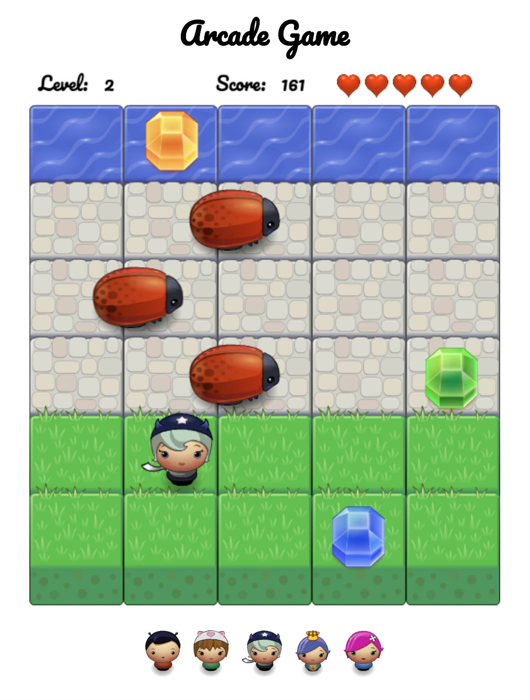

# Arcade Game - Udacity nanodegree scholarship project

This is a simple arcade game made for Udacity Google Nanodegree Scholarship Program.

<<<<<<< HEAD

## Project Goals
=======
## Project Goals
>>>>>>> 3c0731c84e0729a8db6e788cc55ffee3c70680b3

The goal of this project was:
* using OOP
* using HTML5 Canvas
* writing READMEs

## How to play

Move the sprite with arrow keys to get to the river. For collecting randomly generated gems you will earned an extra points. Every touch of the ladybird enemy decrease number of your hearts. The game has five different levels. You can change your sprite costume just by clicking on new one.

## How to run the game

[Click this link  to play the game](https://ewelinaki.github.io/Udacity-Arcade-Game/) or clone repository and run index.html file in your browser.

